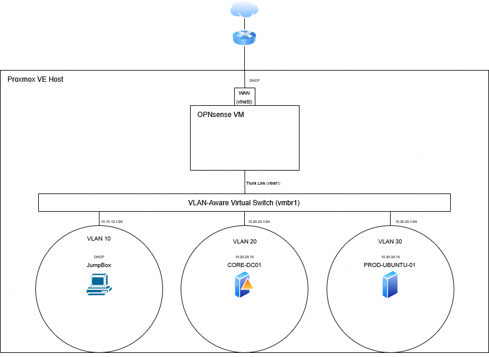

# Enterprise Style Home Lab Environment

A enterprise-grade, zero-trust hybrid lab environment focusing on rigorous network segmentation, centralized identity management, and containerized application orchestration.

## 🚀 Architectural Highlights
* **Network Isolation:** Layer 3 firewall isolation (OPNsense) splitting assets into dedicated MGMT, CORE, and PROD security zones.
* **Centralized IAM:** Full cross-platform Active Directory Domain integration leveraging SSSD and RBAC (`Linux_Admins` group authentication).
* **Application Delivery:** Reverse Proxy edge routing (Nginx Proxy Manager) mapping localized split-horizon DNS entries over private container fabrics.

## 📂 Repository Roadmap
* Detailed Infrastructure Architecture: Check out the full [Operational Manual](documentation/production-manual.md).
* Active Deployment Blueprints: View the [Docker Compose Stacks](stacks/infra-stack/docker-compose.yml).

## 📊 Topology Overview

